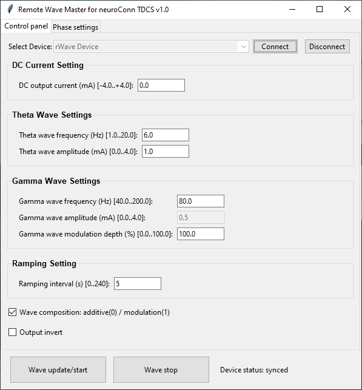

# A Python API for rWave: remote wave generator for the neuroConn tDCS.

## 1. About
This repository contains the API to communicate with the rWave USB-device, developed by the Research Support group of the faculty of Behavioral and Social Science from the University of Groningen. *rWave* is a wave generator to be used with the remote input from the neuroConn TDCS.

## 2. Dependencies
The *rwave-api* API uses [HIDAPI](https://pypi.org/project/hidapi/), a cython module to communicate with HID-class USB devices.

## 3. Install
Install *rwave-api* (and hidapi) with:

`pip install rwavepy` or

`pip install --user rwavepy` on managed computers.

## 4. Device Permission for Linux
Permission for using EVT (HID) devices should be given by adding the next lines to a file, for example named:

`99-evt-devices.rules` in `/etc/udev/rules.d`:

```
# /etc/udev/rules.d/99-evt-devices.rules

# All EVT devices
SUBSYSTEM=="usb", ATTR{idVendor}=="cafe", MODE="0660", GROUP="plugdev"
```

The user should be a member of the `plugdev` -group.

Check with:

`$ groups username`

If this is not the case, add the user to the `plugdev` group by typing:

`$ sudo usermod -a -G plugdev username`

## 5. RemoteWave API Summary

The RemoteWave class provides a Python interface for controlling the rWave device via USB HID.
Public methods are organized into frequency, phase, amplitude, and control APIs.

### Frequency Control
```
write_freq_theta(frequency: float) -> None
Set the frequency of the theta wave in Hz.

Range: FREQ_MIN ≤ frequency ≤ FREQ_MAX.

write_freq_gamma1(frequency: float) -> None
Set the frequency of the gamma1 wave in Hz.

Range: FREQ_MIN ≤ frequency ≤ FREQ_MAX.

write_freq_gamma2(frequency: float) -> None
Set the frequency of the gamma2 wave in Hz.

Range: FREQ_MIN ≤ frequency ≤ FREQ_MAX.
```

### Phase Control
```
write_phase_theta(phase_angle: float) -> None
Set the phase angle of the theta wave in degrees.

Range: PHASE_MIN ≤ phase_angle ≤ PHASE_MAX.

write_phase_gamma1(phase_angle: float) -> None
Set the phase angle of the gamma1 wave in degrees.

Range: PHASE_MIN ≤ phase_angle ≤ PHASE_MAX.

write_phase_gamma2(phase_angle: float) -> None
Set the phase angle of the gamma2 wave in degrees.

Range: PHASE_MIN ≤ phase_angle ≤ PHASE_MAX.

write_start_phase_gamma1(phase_angle: float) -> None
Set the start phase of gamma1 relative to theta, in degrees.

write_start_phase_gamma2(phase_angle: float) -> None
Set the start phase of gamma2 relative to theta, in degrees.
```

### Amplitude Control
```
(if you expose them — otherwise these remain internal)

write_ampl_theta(amplitude: int) -> None
Set amplitude for the theta wave.

Range: AMPL_MIN ≤ amplitude ≤ AMPL_MAX.

write_ampl_gamma1(amplitude: int) -> None
Set amplitude for the gamma1 wave.

write_ampl_gamma2(amplitude: int) -> None
Set amplitude for the gamma2 wave.
```

### Device & Output Control
```
open_device() -> None
Open connection to the rWave device.

close_device() -> None
Close connection to the device.

wave_start() -> None
Start waveform generation.

wave_stop() -> None
Stop waveform generation.

send_params() -> None
Send the current parameter buffer (hid_out_pkg) to the device.
```

## 6. Python coding examples

```
from rwave_api import RemoteWave

mywave = RemoteWave()
#print(mywave.scan())

mywave.attach()

input("Press Enter to continue...")

try:
    mywave.write_freq_theta(3.0)
except ValueError as e:
    logging.error("Invalid parameter: %s", e)

mywave.start()

mywave.close()

```

## rWave Master GUI

The *rWave Master* control panel:



**Usage:**
* 1. Connect the rWave device to the PC.
* 2. First open the *Select Device* dropdown menu, select *rWave* and press *Connect*.
* 3. Change settings and press *Wave update/start* to start generating the wave.

**Description of the input fields:**


## 7. License
The *rWave-api* API is distributed under the terms of the GNU General Public License 3.
The full license should be included in the file COPYING, or can be obtained from

[http://www.gnu.org/licenses/gpl.txt](http://www.gnu.org/licenses/gpl.txt)

